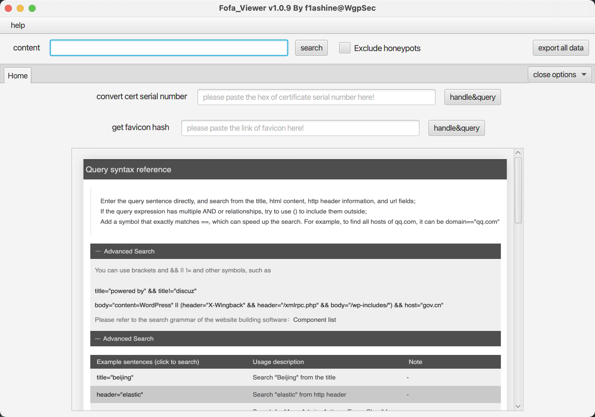
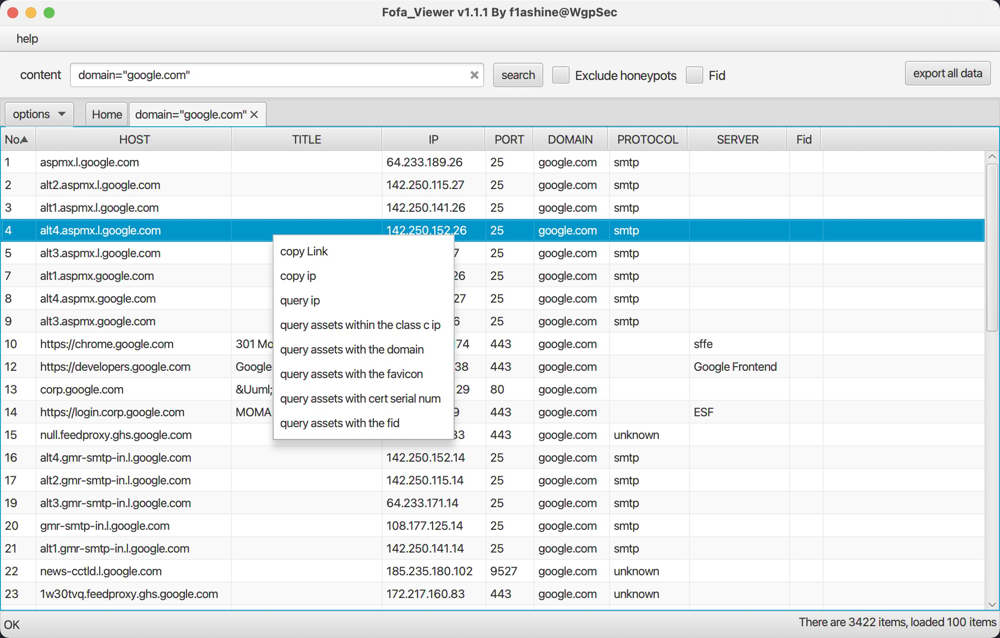
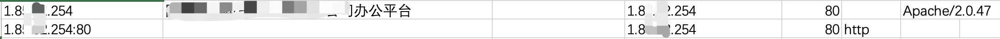
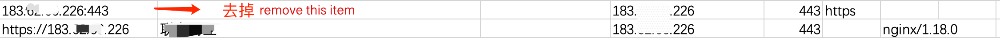
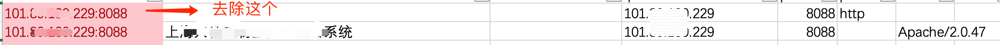
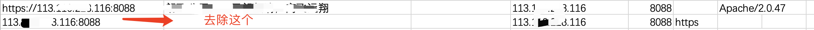
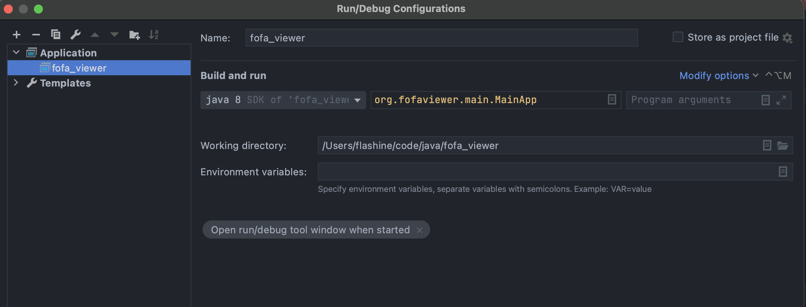
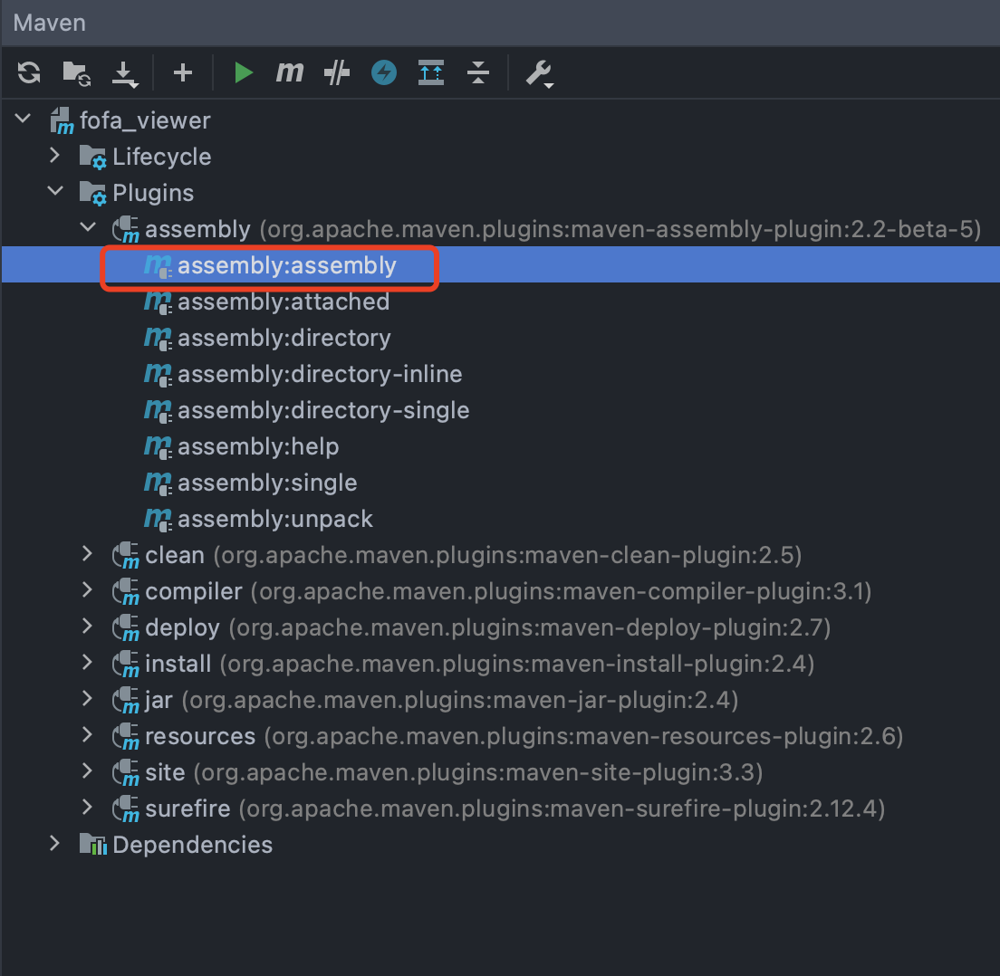

<h1 align="center">Fofa_Viewer 🔗 </h1>
<p align="center"> 


</p>

[中文](README.md) | EN

## Introduction

Fofa Viewer is a user-friendly FOFA client written in JavaFX, attributed to the WgpSec Community and primarily maintained by [**f1ashine**](https://github.com/f1ashine). By leveraging the powerful internet search engine [FoFa](https://en.fofa.info/), it encapsulates many commonly used APIs into a concise UI, making it easier for cybersecurity professionals to hunt for vulnerabilities on target websites. With its out-of-the-box functionality, Fofa Viewer streamlines the search process, helping penetration testers quickly obtain the information they need.

## Usage
The data obtained by this tool through FoFa's API.  
You need to set the API key of senior member or ordinary member to the file config.properties.  
Using the API key of the registered user will prompt that the account needs to be topped up with F coins

Click https://github.com/wgpsec/fofa_viewer/releases to download.

- If you are using JDK11 or higher version, please download the zip package without version number.
- If you are using JDK8, please download FoFaViewer_JDK8.zip

Download [latest build](https://github.com/wgpsec/fofa_viewer/releases/) and edit `config.properties` to start.
The default base domain of FOFA api is `https://fofa.info`. You can change it in config if FOFA made any change.

MacOS users can [Create a Automator Workflow](docs/mac.md) to pin Fofa_Viewer in Dashboard.

## :sparkles: Features
1. Support tabs
2. Feature-rich Context Menu on items
3. Export query result into Excel spreadsheet
4. Manually set max query count pre query for non-premium users (Change value of `maxSize` in `config.properties`)
5. Fill hex certificate signature into homepage's toolbox to convert it to FOFA's decimal format. Use `cert="converted_value"` to match a certain SSL certificate. [Example (zh)](https://mp.weixin.qq.com/s/jBf9h6IQVja6WwFcSYEvKg)
6. Input autocompletion
7. Support FOFA's exclude fraud/honeypot feature (Only for FoFa senior user, will mark a `(*)` in tab when active)
8. Support Fid query (Only for FoFa senior user, need to check the box)
9. FOFA grammar cheatsheet




## Q&A
1. Why I can't export more than 10000 items?

  Due to FOFA API limitions, only a maximum of 10000 items can be returned in a single query.
  Please try adding `after` and `before` criteria to limit total data count.

2. Why not all data can be displayed and exported?

  We removed some duplicates in returned data. Following types of data are removed:
  - Port 80: remove items with `http` protocol field
    
  - Port 443: remove items with `https` protocol field
    
  - Non port 80: remove items with `http` protocol field
    
  - Non port 443: remove items with `https` protocol field
    

3. Why some favicons are missing?

  A browser do following steps to get a favicon:
  - Select `<link rel="icon" href=...>` tag in HTML header
  - If no such tags are found, try load `favicon.ico` in site root
  - If no such file, no favicon is provided

  This tool use jsonp to parse HTML document, thus it is unable to parse some js-bundled site. In this case, paste favicon link into homepage's hash box manually.
   
4. How to sort both IP and Port fields?

  Click IP or Port's column heading to select it, then hold shift and select another column to sort together.

## :rocket: Development

Clone the project:

```
git clone https://github.com/wgpsec/fofa_viewer.git
```

Add following Run/Debug Configuration in IDEA:



Run `assembly:assembly` target, then copy all "with-dependencies" dependencies in `target` folder into the folder containing `config.properties`




## ⚠️ Note
- Configure `email` and `key` in `config.properties` before use.
- Attach `error.log` if you encountered a bug and wish to file an issue.
- Launch fofaviewer in a terminal if any unhandled error occurred. Please then report it to us with detailed traceback.


[](https://starchart.cc/wgpsec/fofa_viewer)


