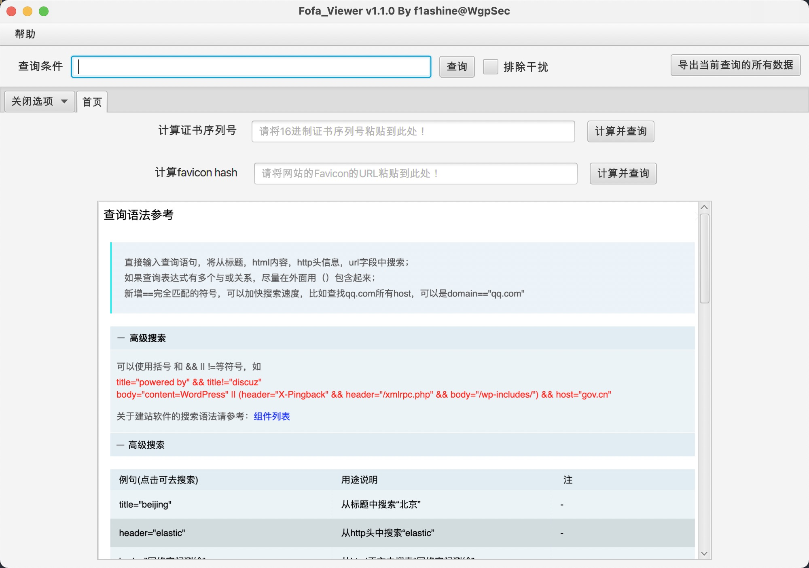
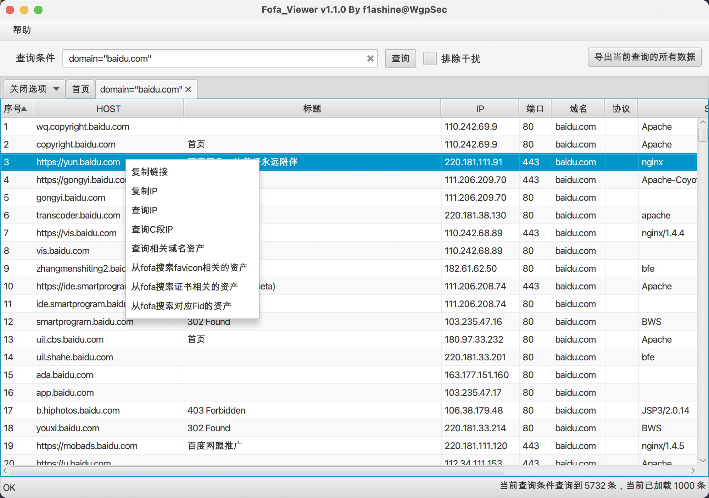

  <p align="center">
    <a href="https://github.com/wgpsec/fofa_viewer/releases">release下载</a>
    ·
    <a href="https://github.com/wgpsec/fofa_viewer/issues">反馈Bug</a>
    ·
    <a href="https://github.com/wgpsec/fofa_viewer/issues">提交需求</a>
  </p>

<p align="center"> <a href="https://github.com/wgpsec/fofa_viewer/blob/master/README.md">中文</a> | <a href="https://github.com/wgpsec/fofa_viewer/blob/master/README.en.md">EN</a> </p>

##  简介
Fofa Viewer 是一个用 JavaFX 编写的用户友好的 FOFA 客户端，属于 WgpSec 社区，主要由 f1ashine 维护。 利用强大的互联网搜索引擎FoFa，将众多常用的API封装到简洁的UI中，让网络安全专业人士更容易在目标网站上寻找漏洞。 凭借其开箱即用的功能，Fofa Viewer 简化了搜索过程，帮助渗透测试人员快速获取所需信息。
##  使用说明
本工具基于 FoFa 的 API 进行封装，使用时需要高级会员或者普通会员的 API key，使用注册用户的 API key 会提示账户需要充值F币。

点击 https://github.com/wgpsec/fofa_viewer/releases 下载

- 如果你使用的是 JDK11 以及更高的 Java 版本，请选择不带版本号的zip包使用
- 如果你使用的是 **JDK8** 版本，请选择下载 FoFaViewer_JDK8

JDK16+ 在导出 Excel 时会报错，可在命令行添加 JVM 参数 `--illegal-access=permit` 以导出。

下载后修改 `config.properties`即可开始使用，api参数默认为`https://fofa.info`，若fofa官方更换域名可修改该参数后再使用。

Mac 用户可通过 [自动化操作创建应用程序](docs/mac.md) 建立快速启动 Fofa_Viewer 的快捷图标

**若下载速度太慢可以使用**

https://hub.fastgit.xyz/wgpsec/fofa_viewer (推荐)

https://gitee.com/wgpsec/fofa_viewer （镜像）

**FOFA会员说明链接！！！！！**

VIP说明：https://fofa.info/static_pages/vip

## :sparkles: 功能
1. 多标签式查询结果展示
2. 丰富的右键菜单
3. 支持查询结果导出为excel文件
4. 支持手动修改查询最大条数，方便非高级会员使用(修改`config.properties`中的`maxSize`即可)
5. 支持证书转换 将证书序列填写入启动页框内可转换，再使用 `cert="计算出来的值"` 语法进行查询 [具体例子](https://mp.weixin.qq.com/s/jBf9h6IQVja6WwFcSYEvKg)
6. 支持输入智能提示
7. 支持fofa的一键排除干扰（蜜罐）功能。（注：需要高级会员，使用时会在tab页标记`(*)`）
8. 支持Fid查询（注：需要高级会员，查询时需要勾选）
9. 支持full查询(查询全部数据)
10. 显示fofa官网的查询语法
11. 滚动条移动到末端时自动加载下一页，可在配置中设置否自动检查账号剩余可查询量。




## Q&A
1. 为什么查询显示结果超过了10000条，但是导出的数据不到10000条？  
    由于fofa api的限制，每个查询条件最多获取10000条数据，所以超过10000条以后的数据将无法导出，可尝试通过关键字`after`和`before`限制查询时间来获取数据。

2. 为什么界面显示和excel导出的数据比查询到的数据要少？  
    由于fofa查询到的http数据中有部分数据重复，为了二次扫描和查看方便，工具做了去重处理，具体分为以下四种情况:
  - 端口为80：去掉协议头显示为http的数据
    
  - 端口为443：
    
  - 非80端口的http
    
  - 非443端口的https
    
    
3. 为什么有的网站明明有favicon但是请求不到？  
    说一下浏览器获取favicon的流程：  
   ① 先去html的header标签中提取`<link rel=icon href=xx>`，然后加载href中的链接  
   ② 如果没有link标签，浏览器会加载根目录的`favicon.ico`，如果响应404就代表网站未提供favicon  
    本工具使用的是`jsoup`对网页进行解析，对于使用Vue一类构建的网站只能通过chrome进行js解析后获取link标签然后获取favicon地址，对于这种情况目前只能将favicon的链接粘贴到首页进行查询。
   
4. IP和端口两个一起排序？  
    先点击IP或者端口这一列的header进行排序，然后按住shift点击另一列就可以一起排序了。

5. 为什么勾选title后查不到数据？  
    目前部分fofa数据较为敏感，因此在查询数据较多且敏感数据也在查到的数据中时可能就会因为数据敏感导致所有数据都不显示了，建议可以设置`maxsize=100`再勾选title进行查询，另外同时勾选title和证书查询可能也会存在查不到数据的情况，建议两者只勾选一个。  

6. 为什么使用普通会员的API查询会报错？  
    因为fofa官方限制了普通会员单次查询的最大数量为100，因此当maxsize超过100时就会报错，显示`401 Unauthorized`。

## :rocket: 二次开发
```
git clone https://github.com/wgpsec/fofa_viewer.git
```

本项目使用 `maven-assembly-plugin`打包编译，可按照下图进行配置


idea打开项目，等待依赖包下载完毕后直接双击Plugins-assembly-assembly:assembly，然后将target文件夹中带有"with-dependencies"的jar包拷贝到带有config.propertiese的文件夹再运行即可。


## ⚠️ 说明
- 使用前需要在`config.properties`中配置`email`和`key`才能正常使用 **FOFA高级会员**
- 项目中配置了error.log，如果有需要提bug，希望能带上这个截图，另外也欢迎提issue帮助改进。
- 如果出现了bug，不知道哪出错了，也可以在终端使用`java -jar fofaviewer.jar`启动，出错后终端会显示具体的错误详情，提交issue的时候请带上截图。
- 关注公众号回复 “加群” 即可加入官方交流群


## 🙏Thanks
- [FOFA共创者计划](https://fofa.info/development)


##  JetBrains OS licenses
``fofa_viewer`` had been being developed with `IDEA` IDE under the **free JetBrains Open Source license(s)** granted by JetBrains s.r.o., hence I would like to express my thanks here.

<a href="https://www.jetbrains.com/?from=wgpsec" target="_blank"></a>

[](https://starchart.cc/wgpsec/fofa_viewer)

