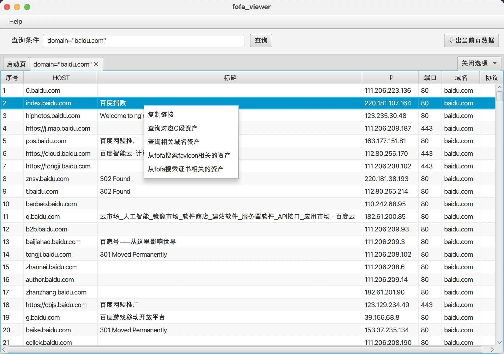

<h1 align="center">Fofa_Viewer 🔗 </h1>
<p align="center"> 


</p>


##  简介

Fofa_Viewer 一个简单易用的fofa客户端由WgpSec狼组安全团队 [**f1ashine**](https://github.com/f1ashine) 师傅主要编写 ，程序使用使用javafx编写，便于跨平台使用

##  使用

下载最新版本包，修改`config.properties` 即可开始使用

MAC 用户可以参考[@zhaodie 师傅的文章]([http://www.jizhao.net.cn/index.php/2021/04/15/mac%e8%a7%a3%e5%86%b3fofa_viewer%e6%97%a0%e6%b3%95%e5%90%af%e5%8a%a8/](http://www.jizhao.net.cn/index.php/2021/04/15/mac解决fofa_viewer无法启动/))来配置快速启动 

查询语法可参考 https://fofa.so/ 

**若下载速度太慢可以使用**

https://hub.fastgit.org/wgpsec/fofa_viewer（推荐）

https://gitee.com/wgpsec/fofa_viewer （镜像）

## :sparkles: 功能
1. 多标签式查询结果展示
2. 丰富的右键菜单
3. 支持查询结果导出
4. 支持手动修改查询最大条数，方便非高级会员使用(修改`config.properties`中的`maxSize`即可)
5. 支持证书转换 将证书序列填写入启动页框内可转换，再使用 `cert="计算出来的值"` 语法进行查询 [具体例子](https://mp.weixin.qq.com/s/jBf9h6IQVja6WwFcSYEvKg)



## :rocket: 二次开发
```
git clone https://github.com/wgpsec/fofa_viewer.git
```

本项目使用 `maven-assembly-plugin`打包编译，可按照下图进行配置


idea打开项目，等待依赖包下载完毕后直接双击Plugins-assembly-assembly:assembly，然后将target文件夹中带有"with-dependencies"的jar包拷贝到带有config.propertiese的文件夹再运行即可。


## ⚠️ 说明
- 使用前需要在`config.properties`中配置`email`和`key`才能正常使用
- 项目中配置了error.log，如果有需要提bug，希望能带上这个截图，另外也欢迎提issue帮助改进。
- 关注公众号回复 “加群” 即可加入官方交流群


[](https://starchart.cc/wgpsec/fofa_viewer)


