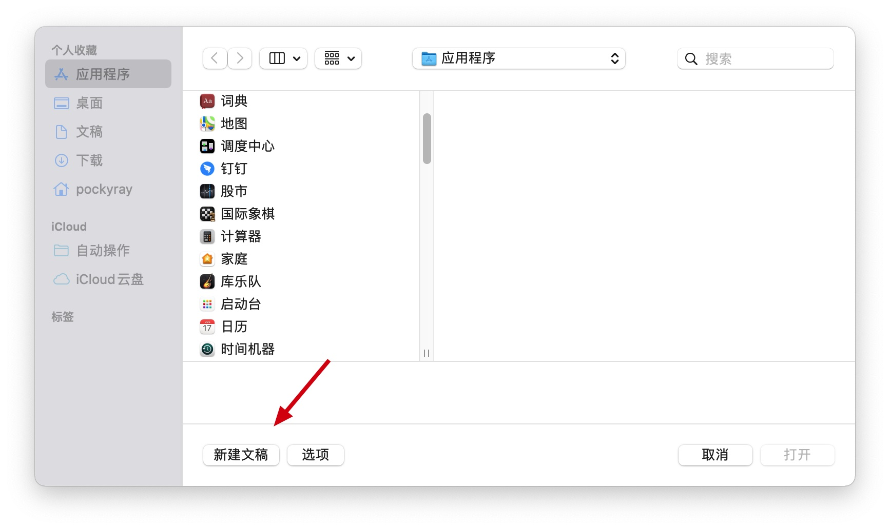
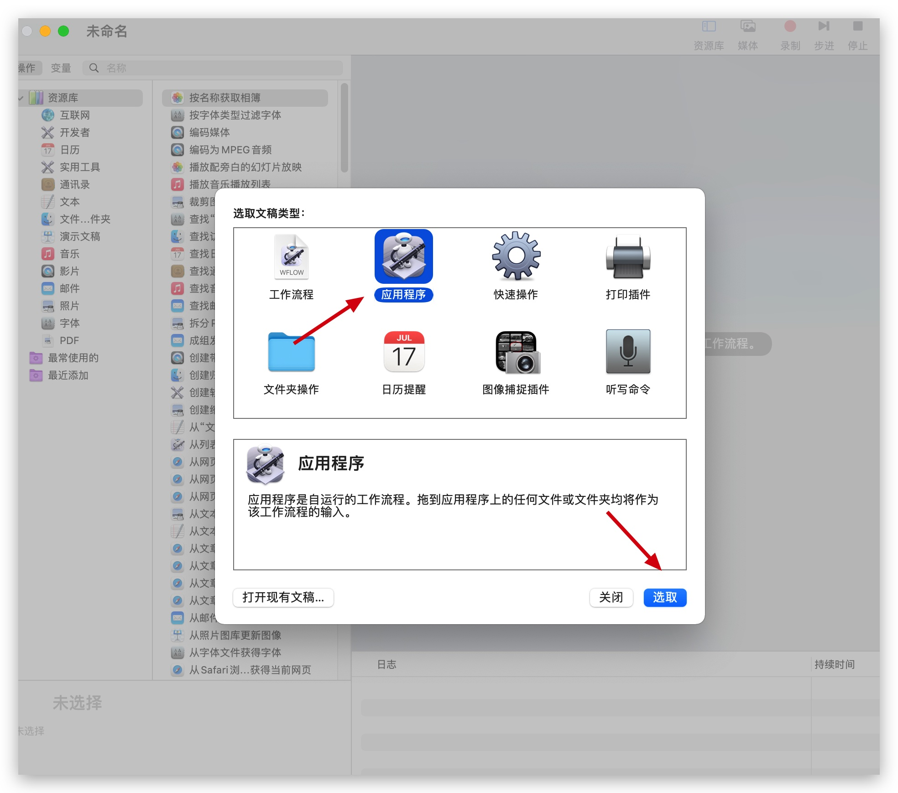
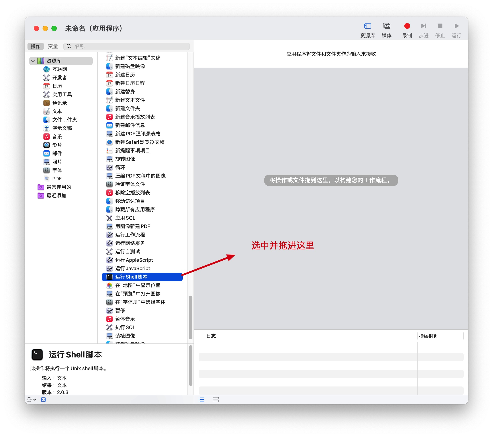
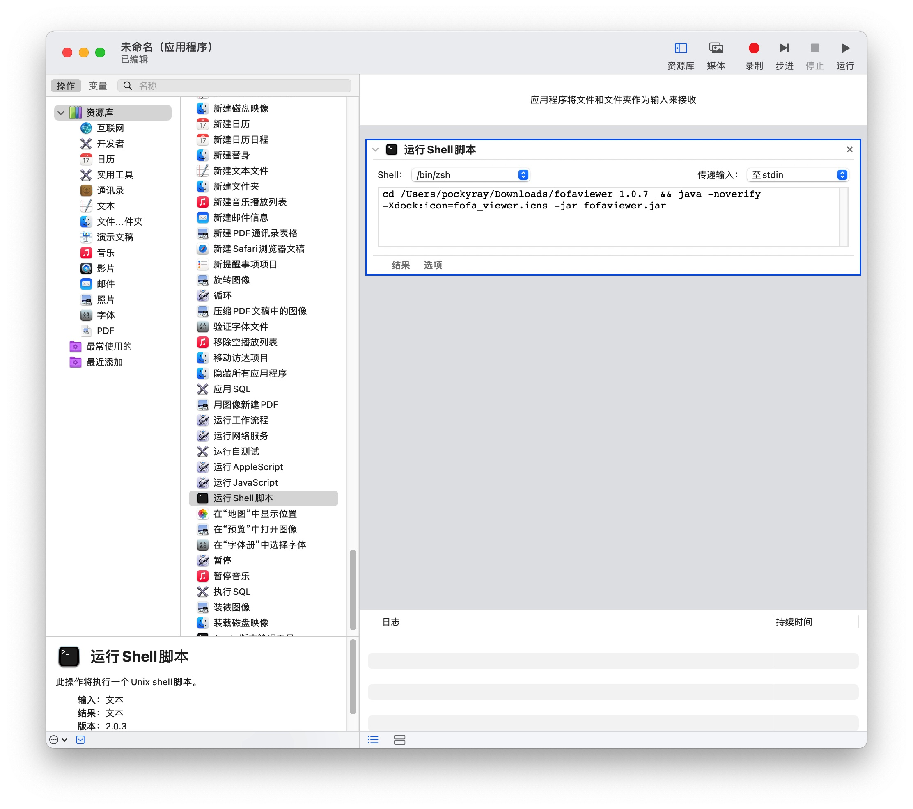
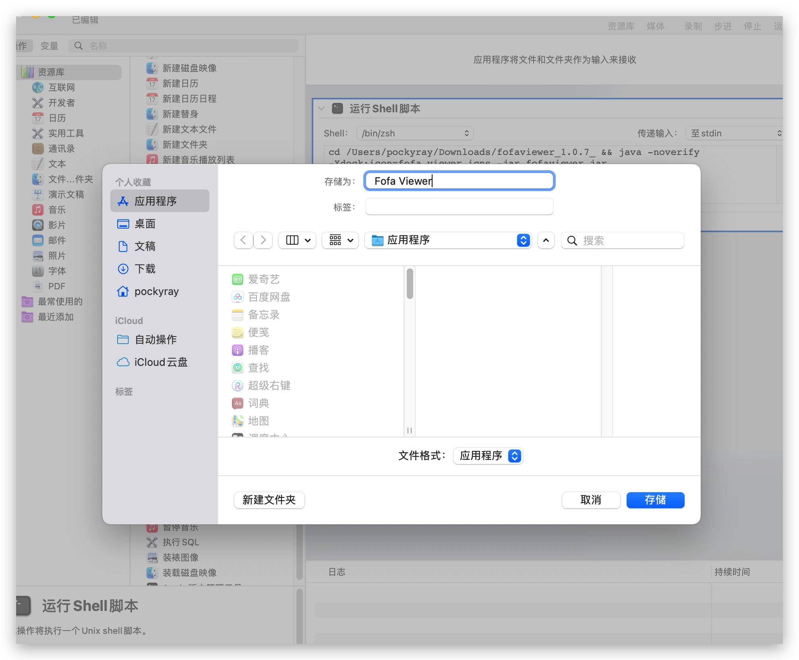
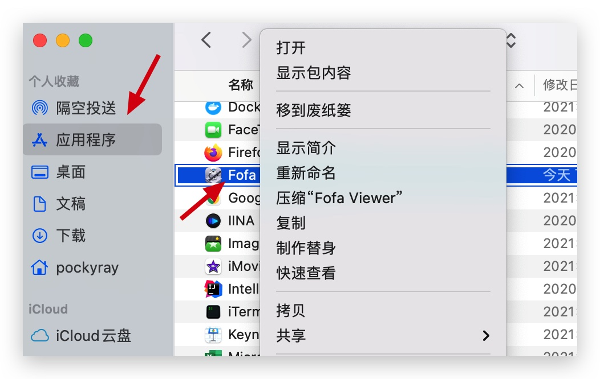
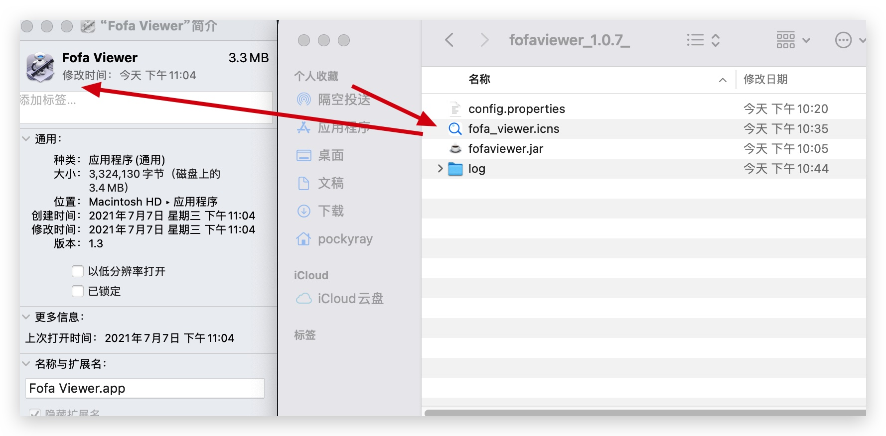
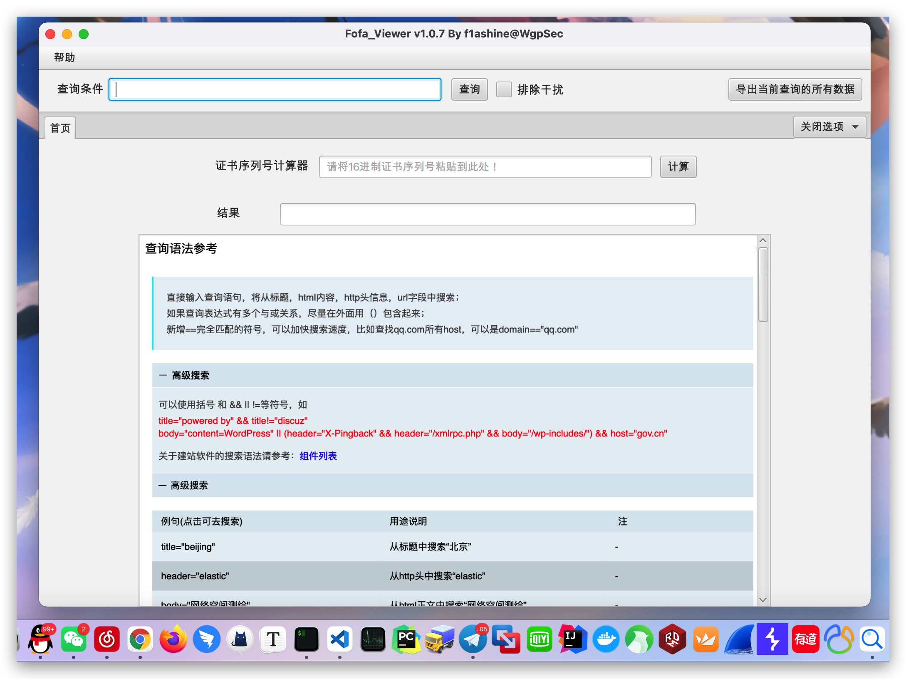

# Mac 用户配置快速启动 fofa_viewer

## 通过 MacOS 自带的 automator.app（自动操作）制作属于Fofa_Viewer的应用程序

> 快捷键：command + 空格


### 点击新建文稿



### 选中应用程序并点击选取



### 选中Shell脚本类型并拖进旁边空白处



### 输入Shell脚本内容

这里给出命令行模板，请根据实际环境自行更改路径。

```cd /Users/pockyray/Downloads/fofaviewer_1.0.7_ && java -noverify -Xdock:icon=fofa_viewer.icns -jar fofaviewer.jar```



### 保存为应用程序

快捷键 `command + s` 保存到应用程序中



### 更改应用程序的图标

进入到应用程序，找到你所创建的应用，并右键点击“显示简介“



随后将icns图标文件拖入箭头所指处



## 效果图


